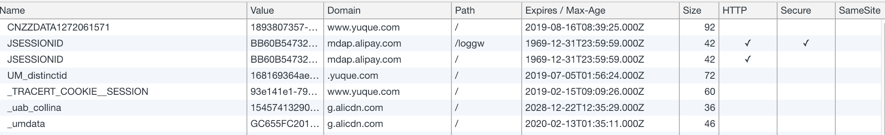

# cookie

> 本文 cookie 特指浏览器 cookie。

浏览器 cookie 是一小段服务器发送给用户浏览器的数据，一般在 HTTP 请求头里就是 `key1=value1; key2=value2` 格式的字符串（注意「分号和空格」间隔）。浏览器会存储它，并在下一次请求时附带到请求中（请求头的 `cookie` 字段）。

Chrome 浏览器查看「[语雀](www.yuque.com)」网页的 cookies 信息，部分截图如下：



关键信息说明：

* Name: `key=value` 的 `key`。
* Value: `key=value` 的 `value`。
* Domain: 对应 `domain=xx.xx` 中的 `xx.xx`，用来限定 cookie 生效的 host，默认为当前页面的域名，如果是 `.jonge.com` 则可以在子域名（如 `x.jonge.com`）生效，`jonge.com` 只在该域名下生效，子域名不生效。
* Path: 对应 `path=/dir` 中的 `/dir`，限定 cookie 生效的 path，默认为 `/`。
* Expires: http/1.0协议，对应 `expires=Fri Feb 15 2019 23:13:05 GMT`，cookie 过期时间
* Max-Age: http/1.1协议，对应 `max-age=1000` 中的 `1000`，表示还有 1000 秒过期，默认 -1（session关闭则删除），负数同-1，0 表示删除，正数表示 `创建时间 + max-age` 之后 cookie 删除。
* HTTP: 对应是否有 `httonly` 字段，有此字段表示只有 HTTP 请求才能取到此 cookie，否则获取不到（比如通过 Javascript 的 `document.cookie` 来读取。
* Secure: 对应是否有 `httonly` 字段，有表示只有 HTTPS 协议的请求才会附带此 cookie

「注意」: 当跨域发送 AJAX 请求时，默认不会附带 cookie，要想在请求时自动附带上 cookie，应该 在 `XMLHttpRequest` 时设置 `xhr.withCredentials = true`，或 `fetch` 时 `fetch(url, { credentials: 'include' })`。

`domain` 和 `path` 一起决定了什么请求 URL 可以访问 cookie，如果存在多个域名下的 cookie，那么发起什么请求，会附带对应的 cookie。

## 创建 cookie

设置 cookie 一般在服务端通过响应头 `set-cookie` 实现，相同 domain 和 path 下的相同 key 只能有一个。

nodejs 示例：

```js
response.setHeader('set-cookie', 'key=value');
// 在 Response Header 是
// Set-Cookie: key=value

response.setHeader('set-cookie', ['key1=value1','key2=value2; httponly']);
// 在 Response Header 是
// set-cookie: key=value
// set-cookie: key=value; httponly
```

也可以在客户端通过 `document.cookie = 'key=value'` 来设置，需要注意一次只能设置一个`key=value`，当 `domain+path` 一样时，相同 `key` 会覆盖（即修改）。

## 删除 cookie

当不设置 `expires` 或 `max-age` 时，默认是 session cookie，即会话关闭（页面关闭）会删除 cookie，但很多时候都是设置了时间的持久性 cookie，即使页面关闭，只要还在有效期内的 cookie 都不会删除。

设置 `max-age=0` 直接可以删除 cookie。


## 安全

浏览器的安全机制，可以保证 httponly 的 cookie 无法被 Javascript 读取，而 secure 可以保证非加密协议下不发送 cookie。

HttpOnly 防止了 XSS，Secure 防止了请求被中间人抓包获取到明文内容，而对于 CSRF，需要采用其它方式来防御，如二次验证，校验 Referer 请求头，验证 tokne 等，这里提供[一篇参考](https://cloud.tencent.com/developer/article/1004943)。

## 一个示例

启动两个会设置不同 domain 的 server，一个 server 返回的页面会请求另一个server，从而此页面拥有两个 domain 的 cookie。

```shell
node server1.js

node server2.js
# 访问 http://jonge.com:3001 查看 cookie 情况，和 node 的日志，以及访问 http://x.jonge.com:3001 查看会自动携带什么 cookie
## 需要设置本地 host: 
本地非 127.0.0.1 IP jonge.com
本地非 127.0.0.1 IP x.jonge.com
```

* server1，设置 `domain=127.0.0.1`:

```js

const http = require('http');

const hostname = '127.0.0.1';
const port = 3000;

const server = http.createServer((req, res) => {
  console.log('request cookie is: ', req.headers.cookie);

  res.statusCode = 200;
  res.setHeader('Content-Type', 'text/plain');
  res.setHeader('set-cookie', ['who=local; domain=127.0.0.1; path=/', 'who=still local; httponly']);
  res.end('Hi Cookie\n');
});

server.listen(port, hostname, () => {
  console.log(`Server running at http://${hostname}:${port}/`);
});
```

* server2:

注意设置成 `domain=jonge.com` 和默认的区别。

```js
const http = require('http');

const hostname = '192.168.0.105'; // 本地 IP
const port = 3001;

const server = http.createServer((req, res) => {
  console.log(req.headers.cookie);

  res.statusCode = 200;
  res.setHeader('Content-Type', 'text/html');
  res.setHeader('set-cookie', [
    'who=jonge; domain=jonge.com; path=/', // 最终在浏览器中是 .jonge.com
    'who=httponly jonge; path=/; httponly', // 浏览器默认是 jonge.com
    'key=value; domain=.jonge.com'
  ]);
  res.end(
    '<p>hi cookie, image below is for fetch cookie from http://127.0.0.1:3000</p>'
  );
});

server.listen(port, hostname, () => {
  console.log(`Server running at http://${hostname}:${port}/`);
});
```